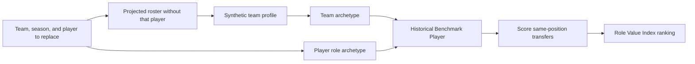

# Roster IQ

Roster IQ is a context-aware analytics engine for evaluating Division I men's college basketball transfers. Instead of asking which portal player is best overall, it asks a more useful roster-building question:

> Which available transfer best replaces a specific player on a specific team?

The project models the identity of the remaining roster, identifies the role of the player being replaced, builds a historical **Benchmark Player** for that context, and ranks same-position transfer candidates by fit and value.

Roster IQ is an active research project developed by Seth Rojas under the mentorship of Dr. Mihai Surdeanu at the University of Arizona. See the [research poster](./RESEARCH_POSTER.pdf) for the latest methodology and historical testing summary, or the [final report](./FINAL_REPORT.pdf) for the earlier BPM-prediction phase of the project.

## How it works



1. **Build a replacement scenario.** Roster IQ loads the incoming roster and removes the selected player.
2. **Estimate the team's identity.** The remaining players are aggregated into a synthetic team profile using efficiency, shooting, rebounding, and possession-based statistics.
3. **Match team and player archetypes.** PCA and k-means artifacts assign the projected team to a team archetype and the outgoing player to weighted, position-specific player archetypes.
4. **Create a Benchmark Player.** Recent historical players from comparable team and player clusters are combined into a contextual statistical prototype.
5. **Rank candidates.** Same-position transfers are compared with the benchmark on style and production, then ordered by a composite score.

The current clustering artifacts cover the 2021-2024 seasons. Benchmark calculations use a three-season historical lookback.

## Metrics

| Metric | What it measures | Main output |
| --- | --- | --- |
| **Fit Score (FS)** | Cosine similarity between a candidate and the Benchmark Player on usage, shot selection, creation, and scoring-volume features. Values closer to `1` indicate a stronger stylistic fit. | `sim_score` |
| **Value Over Clustered Benchmark Player (VOCBP)** | A position-weighted average of the candidate's standardized production above or below the benchmark, with a one-sided strength-of-schedule adjustment. Higher is better. | `vocbp` |
| **Role Value Index (RVI)** | A robust composite of Fit Score and VOCBP, weighted 60/40. The implementation uses median/MAD normalization, caps extreme values, and reports an interpretable T-score. | `comp_T` |
| **Benchmark Success Score (BSS)** | A historical, end-of-season impact comparison with the Benchmark Player. It is used to evaluate the ranking method rather than to rank current candidates. | Success when `BSS > -0.05` |

The model also reports effective sample size (ESS) for the weighted benchmark. Historical evaluation treats `ESS >= 30` as the preferred confidence threshold.

## Quick start

### 1. Install the project

Python 3.10 or newer is recommended.

```bash
git clone https://github.com/sethrojas21/Roster-IQ.git
cd Roster-IQ

python -m venv .venv
source .venv/bin/activate
pip install -r requirements.txt
```

The API and analysis code use precomputed PCA and clustering artifacts committed under `Analysis/Clustering`. R is only required if you intend to rebuild those artifacts.

### 2. Configure the database

The API connects to a Turso/libSQL database. Create a `.env` file in the repository root:

```dotenv
TURSO_URL=libsql://your-database.turso.io
TURSO_AUTH_TOKEN=your-auth-token
```

The source database and raw data files are not committed to this repository. You need access to a compatible Roster IQ database containing the player, player-season, team-season, recruiting, and cluster fields expected by the SQL queries.

### 3. Start the API

```bash
uvicorn Analysis.api:app --reload
```

Confirm that it is running:

```bash
curl http://127.0.0.1:8000/
```

Expected response:

```json
{"ok": true}
```

Interactive API documentation is available at `http://127.0.0.1:8000/docs`.

### 4. Rank replacements

The `/compute` endpoint accepts a team, incoming season, and the ID of the player whose roster role should be replaced:

```bash
curl --get http://127.0.0.1:8000/compute \
  --data-urlencode "team_name=Arizona" \
  --data-urlencode "season_year=2024" \
  --data-urlencode "player_id_to_replace=72413"
```

The response contains the generated benchmark context and a ranked `composite_scores` list. Candidate records include the raw fit and value metrics, their robust standardized values, percentile comparisons, SOS adjustment information, and the final `comp_T` ranking score.

## Running the analysis locally

The Makefile provides shortcuts for the main analysis and historical evaluation scripts:

```bash
make calcCompositeScore
make calcFitScore
make calcVOCRP
make checkSuccessfulTransfer
make evalClusterAvgs
```

These commands expect a compatible `rosteriq.db` file and, for some research workflows, generated CSV, JSON, Feather, or RDS inputs that are not stored in Git. Several scripts contain built-in example teams and players and are intended as research entry points rather than a packaged command-line interface.

## Data and modeling pipeline

The research database contains more than 35,000 player and team records assembled from:

- Bart Torvik player and team statistics
- Division I university roster pages
- ESPN recruiting rankings
- JUCORecruiting rankings

Statistics are converted into possession-based or rate features where appropriate. PCA reduces correlated team and player features before k-means clustering. Teams are clustered by playing style and performance, while players are clustered separately as guards, forwards, and centers. Human-readable labels turn those clusters into archetypes such as facilitating guards, stretch bigs, defensive anchors, and run-and-gun teams.

Raw third-party data is not redistributed in this repository. The committed PCA parameters, rotations, loadings, cluster profiles, archetype labels, and SOS adjustments allow the scoring code to reuse trained transformations without rebuilding every model.

## Historical evaluation

Roster IQ evaluates past transfers by recreating the information available for a replacement decision, ranking the relevant transfer pool by RVI, and comparing the player's following season with the contextual benchmark using BSS.

The research poster reports 335 correct high-RVI/success or low-RVI/unsuccessful classifications across 647 evaluated cases: **51.8% accuracy against a 35.6% estimated chance rate** (`p = 8.97e-17`). Results with an ESS threshold were similar across repeated runs. These findings are retrospective and should be treated as evidence for continued evaluation, not as a guarantee of future player outcomes.

The project originally attempted to predict next-season BPM directly with XGBoost. Although binary BPM classification reached 78% accuracy, precise BPM regression remained too noisy and context-dependent. That result motivated the current benchmark-player approach, which emphasizes role awareness and interpretability over a single point prediction.

## Repository structure

```text
Analysis/
  Benchmark/          Build contextual Benchmark Player statistics
  CalculateScores/    Fit Score, VOCBP, RVI, and SOS adjustment
  Clustering/         PCA, k-means, archetype matching, and model artifacts
  EvaluateMetrics/    Benchmark Success Score
  Helpers/            Database loading, scaling, weighting, and similarity
  SyntheticRosters/   Projected roster aggregation
  Testing/            Historical evaluation scripts
  api.py              FastAPI entry point
Database/             Database creation and enrichment utilities
FreshmenJUCO_Rankings/ Recruiting-data collection and matching
OldPlayerInformationExtraction/
                      Earlier roster-page extraction experiments
```

## Project status

Roster IQ is a research prototype. Current work includes prospective testing with basketball professionals, improving role definitions beyond fixed positions, testing alternative clustering approaches, adding richer basketball features, and expanding contextual adjustments.

The companion [Roster-IQ-Web](https://github.com/sethrojas21/Roster-IQ-Web) project is building the historical-results dashboard and coach-facing interface for this analysis engine.

## Authors and acknowledgments

Created by **Seth Rojas** and mentored by **Dr. Mihai Surdeanu** through the BIO5 Institute Flinn Scholar Research Experience at the University of Arizona.
